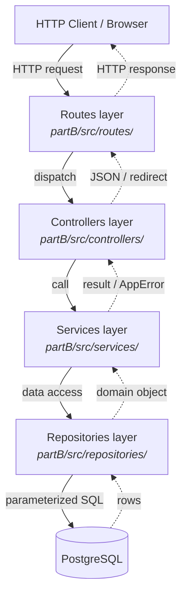
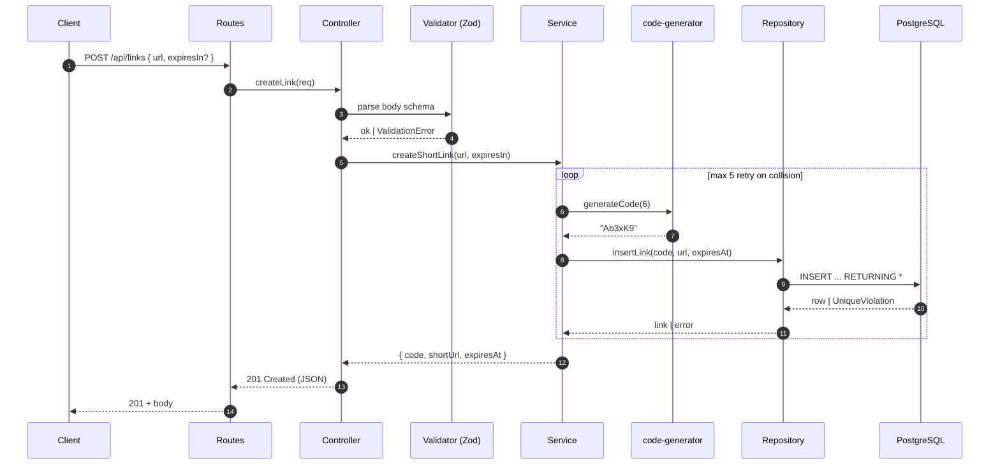
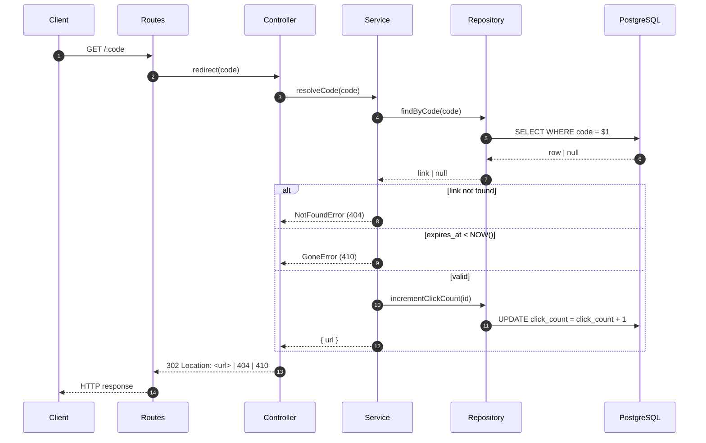

# ARCHITECTURE.md — Архитектурын баримт

> А хэсэг (Төлөвлөлт)-ийн баримт. URL Shortener-ийн ерөнхий архитектур,
> module-ууд, өгөгдлийн урсгал. Mermaid diagram-аар үзүүлэв.

## 1. Ерөнхий загвар — Layered architecture

Уламжлалт **layered (давхаргат) architecture**-ыг сонгов. Layer бүр зөвхөн
шууд доод layer-тэй харьцана. Layer алгасах хориотой (CLAUDE.md §6).



> Тасархай шугам нь буцаах урсгал (response).

## 2. Module-ийн жагсаалт

Build-ийн (Б хэсэг) явцад дараах бүтцийг үе шаттайгаар бий болгоно:

```
partB/src/
├── app.js                  # Express app тохиргоо (middleware, routes mount)
├── server.js               # listen() — entry point
├── config/
│   └── env.js              # .env уншиж шалгах
├── routes/
│   ├── link-routes.js      # /api/links — REST endpoints
│   └── redirect-routes.js  # /:code — public redirect
├── controllers/
│   └── link-controller.js  # request unpack → service → response
├── services/
│   ├── link-service.js     # business logic (create, resolve, list)
│   └── code-generator.js   # crypto.randomBytes-аар богино код
├── repositories/
│   └── link-repository.js  # SQL хандалт (зөвхөн энд)
├── middleware/
│   ├── error-handler.js    # AppError → JSON response
│   ├── request-logger.js   # access log
│   └── validate-body.js    # Zod schema validation
├── lib/
│   ├── app-error.js        # custom Error class (statusCode, code)
│   └── url-validator.js    # http(s)-ийн л зөвшөөрнө
└── db/
    ├── pool.js             # pg.Pool үүсгэгч
    └── migrations/
        └── 0001-init.sql   # links table schema
```

### 2.1. Module бүрийн үүрэг

| Module           | Үүрэг                                                              |
|------------------|--------------------------------------------------------------------|
| `routes/`        | URL pattern → controller method-ыг холбох. Логикгүй               |
| `controllers/`   | HTTP-ийн нарийн ширийнтэй (status code, header) ажиллана          |
| `services/`      | Бизнес логик. HTTP-ээс үл хамаарна — pure function-д ойр          |
| `repositories/`  | SQL query, parameterized зөвхөн энд бичигдэнэ                     |
| `middleware/`    | Cross-cutting concerns (auth, log, error, validation)             |
| `lib/`           | Багажийн утгатай туслах модулиуд                                   |
| `db/`            | Pool тохиргоо, migration файлууд                                   |

## 3. Өгөгдлийн урсгал — sequence diagram-ууд

### 3.1. Шинэ богино URL үүсгэх



### 3.2. Богино URL-аар redirect хийх



## 4. Database schema (анхны хувилбар)

```sql
CREATE TABLE links (
    id          BIGSERIAL PRIMARY KEY,
    code        VARCHAR(16) UNIQUE NOT NULL,
    url         TEXT NOT NULL,
    click_count BIGINT NOT NULL DEFAULT 0,
    expires_at  TIMESTAMPTZ,                 -- NULL = заавал биш
    created_at  TIMESTAMPTZ NOT NULL DEFAULT NOW()
);

CREATE INDEX idx_links_code ON links (code);
```

## 5. Чухал шийдвэрүүд (design decisions)

| # | Шийдвэр                              | Үндэслэл                                          |
|---|--------------------------------------|---------------------------------------------------|
| 1 | Богино код урт = 6 тэмдэгт           | 62⁶ ≈ 56 тэрбум хувилбар, академик хэрэгцээнд хангалттай |
| 2 | `crypto.randomBytes` ашиглана        | `Math.random` predictable, security risk          |
| 3 | UNIQUE constraint + retry loop       | Collision-ийг DB level-д шалгаж, шударга шийднэ   |
| 4 | Redirect = 302 (temporary)           | URL-ийг ирээдүйд солих боломж үлдээнэ             |
| 5 | `expires_at` NULL = "хязгааргүй"     | Optional feature — expire хүсээгүй хэрэглэгчид    |
| 6 | Open redirect protection             | Зөвхөн `http`/`https` protocol зөвшөөрнө          |
| 7 | Parameterized query заавал           | SQL injection урьдчилан сэргийлнэ                 |
| 8 | pg.Pool, max=10 connection           | Орон нутгийн dev-д хэт их connection нээхгүй     |

> Эдгээрээс хамгийн чухал нэгийг (магадгүй #1 эсвэл #3-ийг) В хэсгийн ADR-002-т
> дэлгэрэнгүй бичих төлөвлөгөөтэй.

## 6. Хязгаарлалт

- Single-instance app. Horizontal scaling-д тохирсон cache layer (Redis гэх мэт)
  багтаагүй — out of scope (`PROJECT.md` §4)
- Rate limiting middleware out of scope; production-ы өмнө нэмж болно
- Frontend нь pure HTML + жижиг JS — SPA framework ашиглахгүй

## 7. Дараагийн алхам

- ADR-001 (stack сонголт) бичих
- partA/README.md-ийн draft-ыг бичих
- Б хэсэг эхэлмэгц энэ файлыг бодит implementation-аар update хийх
